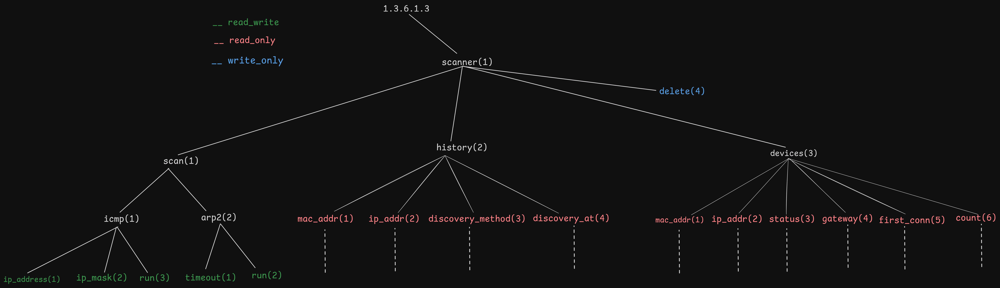

## SNMP Network Scanner

| File/Directory         | Function                                                                                     |
|------------------------|----------------------------------------------------------------------------------------------|
| snmp_agent/            | SNMP agent implementation                                                                   |
| orm.py                 | Database abstraction layer                                                                  |
| net_discover.py        | Network discovery module                                                                    |
| conf.json              | Configuration file containing various settings                                              |
| settings.py            | Abstraction layer for editing `conf.json`                                                   |
| netscan_cli            | Command-line interface (CLI), the main program. Utilizes `settings.py`, `orm.py`, and `net_discover.py`. |
| vendor_solver.py       | Utility to identify a device's vendor from its MAC address                                  |
| function.py            | Functions defining the SNMP agent's responses for each MIB leaf                             |
| main.py                | Runs the SNMP agent, setting up the MIB structure and linking functions from `function.py`  |
| mac-vendors-export.csv | CSV file used by `vendor_solver.py`                                                         |
| ScannerMIB.txt         | MIB file definition                                                                         |

  - [x] Web Scanner Implementation (ICMP and ARP2)  
  - [x] MIb file definition  
  - [x] SNMP-Server Implementation  
  - [] Web Interface
